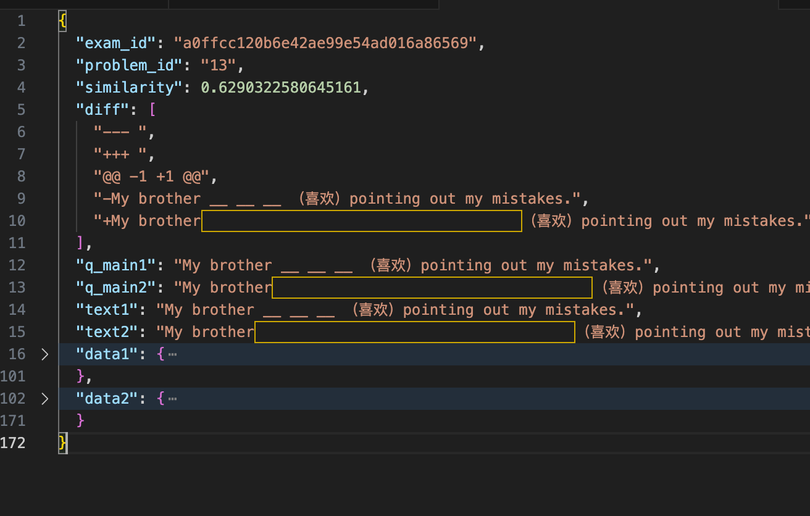

# Check Data Diff
LLM预训练重在数据，而每批次数据调整都会在百万到千万行规模中进行数据操作φ，我们很关心φ是否如预期起作用，就需要进行check_data_diff(φ,φ(x))。当前我们传统方法需要manual check with task-specific script,这是个trial and error的过程，是否能用agents实现这个目标成为大家关心的问题.本项目希望能够成为数据构建toolkit中的一个环节,有助于加速内部数据检查工作流

## 参数说明
dir1和dir2是包含jsonl的文件夹,后续将会值读取jsonl
IS_SAMPLE 用于测试 开启后每个文件只会读取前1000行,交集只考虑100行

## 调用方法

调用方法,打开heck_data_diff.sh文件,修改其中的参数,然后执行以下命令
```bash
./scripts/check_data_diff.sh
```

不调用agents的输出结果:

调用agents的输出结果
```
report_prompt:
下面是评分结果:[{'change_summary': '在q_main2中，原始文本的“传记洪水无私”被替换为“传记洪水无私小题小题小题小题小题小题小题小题小题小题”，这可能意味着在修改后的数据中，对文本进行了分段或者添加了额外的信息。', 'score': 2}, {'change_summary': '修改了数据q_main2中的单位和公式，加入了分米和千克，并更新了计算过程。', 'score': 3}, {'change_summary': '', 'score': 0}, {'change_summary': 'q_main2在q_main1的基础上进行了内容的扩充和组织结构的优化。首先，q_main2将问题分成了三个部分，每个部分都明确了需要回答的问题和对应的分数，使得问题更加清晰具体。其次，q_main2增加了对光荣革命的描述以及与辛亥革命的比较，丰富了讨论的内容。最后，q_main2还提供了亚洲主要国家和地区的背景资料，为最后一个问题的论述提供了更多的信息支持。', 'score': 4}, {'change_summary': "在原始数据q_main1的基础上，q_main2增加了新的段落'河伯东游'，并提供了相应的翻译。此外，q_main2还对原文的格式进行了调整，使其更易于阅读。", 'score': 4}, {'change_summary': '修改后的数据q_main2在原始数据q_main1的基础上增加了对比赛成绩的描述，明确指出比赛成绩均为整数且8分及以上为优秀。此外，q_main2还增加了一个新的问题，要求填写表格中的未知数值并估计成绩在9分及以上的学生人数。', 'score': 4}, {'change_summary': '修改后的数据q_main2增加了设计活动和材料探究两个任务，同时更新了阅读数据的具体信息，使任务更加丰富和具体。', 'score': 4}, {'change_summary': 'q_main2版本增加了对周恩来勤奋学习、坚持不懈品质的描述，通过蒋妈妈讲述稻米生产过程和周恩来坚持练字的故事，展现了少年周恩来的好奇心、求知欲以及对待学习的认真态度。此外，还新增了对词语的理解和解释，以及对蒋妈妈心疼不已的动作描写。', 'score': 4.0}, {'change_summary': '', 'score': 0}, {'change_summary': "在文本中增加了'分'字，使得'爱好者'变成了'分爱好者'，并且修改了问题的编号格式。", 'score': 3}, {'change_summary': '', 'score': 0}, {'change_summary': '修改后的数据q_main2提供了更详细的信息，包括鲍母加特纳跳伞的具体高度、落地时间以及大气温度变化的完整过程。这使得数据更加全面和准确。', 'score': 5}, {'change_summary': '增加了实验的步骤和细节，包括提出问题、建立假设、制定计划、收集证据以及具体的实验操作，使得整个实验过程更加完整和科学。', 'score': 4.0}, {'change_summary': '修改了问题的评分标准，增加了回答数量要求以提高答案质量', 'score': 4}, {'change_summary': '增加了评分标准，明确了总分数和每小题的分数分配。', 'score': 4}, {'change_summary': 'q_main2将q_main1中的填空题进行了格式化，添加了“（共5分，每小题0.5分）”的评分说明，使得题目更加清晰且具有结构性。此外，在每个填空处增加了额外的空格，便于考生填写答案。', 'score': 4.0}, {'change_summary': 'q_main2提供了更详细的模型一和模型二的描述，包括具体的条件、过程和结果。它还明确了社会再生产过程中的四个环节，即生产、分配、交换和消费。', 'score': 5}, {'change_summary': "将'选拔'替换为'进选', 在句子末尾添加了重复的短语'小题小题小题小题小题小题小题小题小题小题'", 'score': 2}, {'change_summary': '修改后的数据q_main2与原始数据q_main1相比，在任务描述部分增加了评分标准，明确指出每个空1分，共10分。同时，对文本进行了格式化，使其更加清晰易读。', 'score': 5}, {'change_summary': 'q_main2提供了更精确的时间信息（农历日期和具体时刻），更详细地描述了探测器的着陆地点（冯•卡门环形山），并明确指出这是中国嫦娥四号探测器的成就。', 'score': 4.0}, {'change_summary': '修改后的数据q_main2相较于原始数据q_main1增加了评分标准，明确了每空1分，共10分的评分体系。这使得评分更加客观且易于操作，对评估者的工作有显著帮助。', 'score': 4.0}, {'change_summary': '增加了关于学生认知功能改善的具体数据，如运算速度、推理能力等的提升，以及反应时间减少和注意缺陷多动障碍症状评分减少的具体数值。', 'score': 4}]
你要对输出结果做个汇总, 汇总内容包括:
q_main2比q_main1好的比例为 22/22
q_main2比q_main1改进的点有:
[需要结合score和change_summary中正向评价新句子的内容进行总结]
q_main2不如q_main1的点有:
[需要结合score和change_summary中负向评价新句子的内容进行总结]

##########gpt-4o的回答

根据提供的评分结果，我们可以得出以下汇总信息：

**q_main2比q_main1好的比例为 22/22**

这个比例表明，在所有评价的项目中，q_main2都比q_main1有所改进或至少保持不变。这表明在整体上，q_main2是一个更好的版本。

**q_main2比q_main1改进的点有:**
1. **内容扩充和结构优化**：q_main2将问题分成了几个部分，每个部分都明确了需要回答的问题和对应的分数，使得问题更加清晰具体。它还增加了对重要历史事件的描述以及与其他事件的对比，丰富了讨论的内容。
2. **信息丰富度增加**：q_main2提供了亚洲主要国家和地区的背景资料，为答题提供了更多的信息支持。此外，它还增加了新段落和翻译，以及实验的步骤和细节，使得数据更加全面和准确。
3. **评分标准的明确和细化**：q_main2增加了或修改了评分标准，明确了每小题的分数分配，提高了答案的质量。
4. **格式和结构的改进**：q_main2对文本进行了格式化，使其更加清晰易读，并且对问题进行了结构化处理，增加了评分说明。

**q_main2不如q_main1的点有:**
1. **语言表达的准确性**：在少数情况下，q_main2的文本中出现了一些不恰当的词语替换，如将“选拔”替换为“进选”，这可能降低了文本的准确性和可读性。
2. **重复信息的加入**：在某些情况下，q_main2在句子末尾添加了重复的短语，如“小题小题小题小题小题小题小题小题小题小题”，这可能造成了信息的冗余。

总结而言，q_main2在多数方面都优于q_main1，特别是在内容丰富度、评分标准明确性和文本结构方面。然而，在语言准确性和信息简洁性方面还有待进一步提升。
```


## 文件结构
```bash
╰─$ tree -L 1
./
├── README.md
├── agents/
├── check_data_diff.ipynb    ipynb版本的脚本
├── check_data_diff.py       主要执行文件,输入dir1,dir2,输出所有diff的output文件
├── output/
├── sample_example_diff.py   从diff的output文件中每个类别抽取一个样本,用户快速可视化
├── scripts/                 shell脚本,调用check_data_diff.py
└── utils/

```

## 修改指南

### 共同的id
不同批次数据id逻辑可能会有变化,修改check_data_diff.py中下面关于key部分
```python
for d in tqdm(data1):
	key = f"{d['id']}"
	exam_problem_id1.append(key)
	exam_problem2data1[key] = d

for d in tqdm(data2):
	key = f"{d['exam_id']}_{d['problem_id']}"
	exam_problem_id2.append(key)
	exam_problem2data2[key] = d
```

### 过滤数据
修改check_data_diff.py中下面关于remove_symbols部分. 比如只保留中文字符对于查看考题的差异是有帮助的
```python
def remove_symbols(text):
	# # 移除所有非字母和非数字字符
	# text = re.sub(r'\$\$', '$', text)
	# only keep chinese characters
	pattern = re.compile(r'[\u4e00-\u9fa5]+')
	# return ''.join(pattern.findall(text))
	return text
```

### 比较数据的field
修改utils/utils.py中下面关于get_q_main部分. 比如只比较考题的内容. 此外两个dir的数据可能字段不一样,需要对应修改
```python
def get_q_main_for_xes_clean(content):
	question_list = content['ori']['question_list']
	q_main_str = content['ori']['q_main']
	options = content['ori']['options']
	res = q_main_str
	for question in question_list:
		res += question
	for option in options:
		res += option
	return res


def get_q_main(content):
	question_list = content['question_list']
	q_main_str = content['q_main']
	options = content['options']
	res = q_main_str
	for question in question_list:
		res += question
	for option in options:
		res += option
	return res
```


## License
懂的都懂
